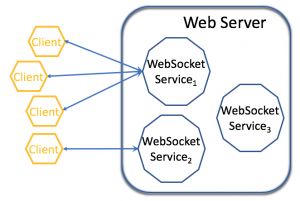

# What are WebSockets?

In the early days of the web, a client and server relationship was viewed as following a single direction of workflow, the client would send a request to the server and the server would respond to the client with the data requested. However, as time progressed, this relationship evolved into one that became bidirectional, with both the client and server sending and receiving data to and from each other.

WebSockets were created as a way of providing a low latency persistent connection that is bidirectional between a client and a server. They are low latency as there is no need to send lots of headers that typical HTTP requests consist of. A WebSocket connection is created with a WebSocket handshake, this involves the client sending an initial HTTP request including an Upgrade' header to which, if the server supports the protocol, it agrees with the request and sends back its own 'Upgrade' header in response. After a successful handshake, the established connection uses the WebSocket protocol 'ws'.

WebSockets send data using a frame-based messaging system that helps reduce the amount of non-payload data that is transferred. Data is transferred as messages that consist of one or more frames containing the payload. Each frame is prefixed with 4-12 bytes of data about the payload so that it can be reconstructed properly. This is useful as the server or client can transfer as much data as they like without all the header overheads that come with traditional HTTP requests.

---

## Kitura WebSockets

[Kitura-WebSocket](https://github.com/IBM-Swift/Kitura-WebSocket) and [Kitura-WebSocket-NIO](https://github.com/Kitura/Kitura-WebSocket-NIO) are two packages that enable WebSocket support for Kitura. They support version thirteen of the WebSocket protocol and are compatible with a variety of WebSocket clients, including: Built in WebSocket support for browsers (Chrome, FireFox and Safari) and the NPM WebSocket package. Both packages also support the WS and WSS (SSL/TLS secured WS) protocols.

---

## Next steps

[Try out](./echo-server) creating a simple Echo Server using Kitura WebSockets.
