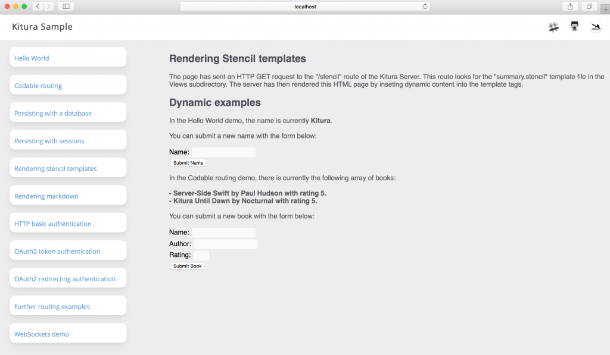
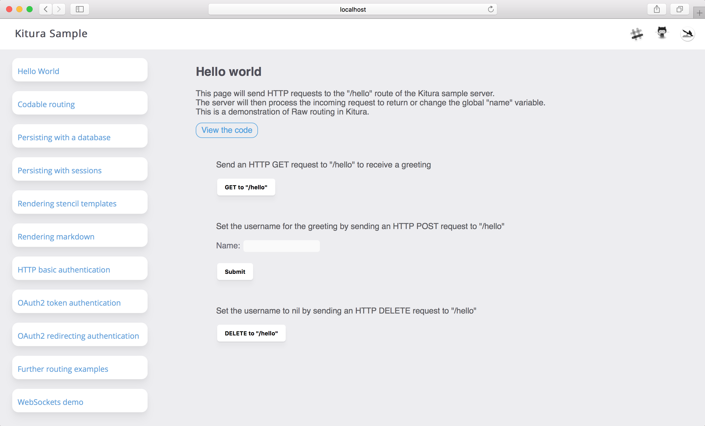
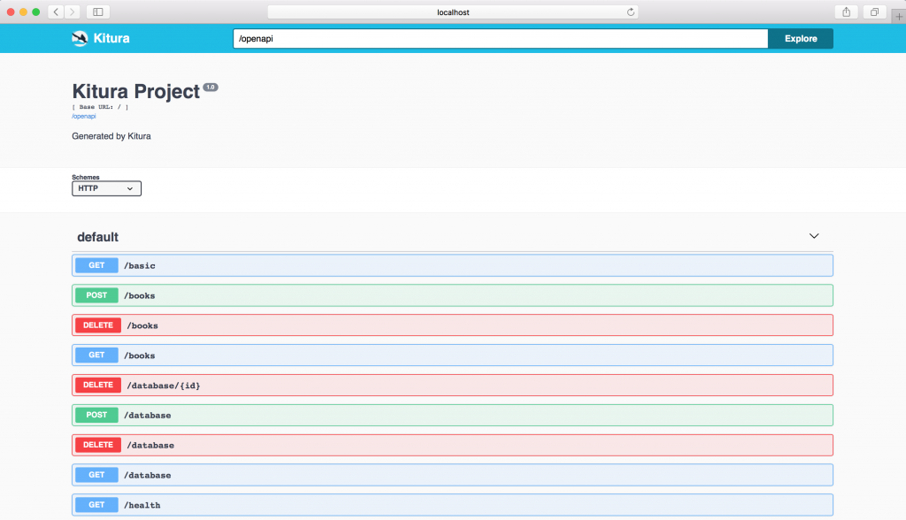

We have rewritten the [Kitura Sample](https://github.com/Kitura/Kitura-Sample) demo application to better showcase the capabilities of Kitura. This update adds interactive webpages so you can try out the features live. You can also easily view the code for each feature by clicking on the embedded links.

Furthermore, we have added new demos for popular features such as databases, sessions and authentication. Altogether, these changes produce an example app which is a great resource for learning to develop using [Kitura](https://www.kitura.dev/).



> Kitura Sample demonstration of rendering dynamic webpages using Stencil

##Swift Server example

Our sample server shows off the following features available in Kitura:

- Hello World example with Raw routing
- Building REST APIs with Codable routing
- Persisting objects to a session store using [Kitura-Session](https://github.com/Kitura/Kitura-Session)
- Rendering HTML web pages from [Markdown](https://github.com/Kitura/Kitura-Markdown) and [Stencil templates](https://github.com/Kitura/Kitura-StencilTemplateEngine)
- HTTP Basic authentication with [Kitura-Credentials](https://github.com/Kitura/Kitura-Credentials)
- OAuth2 authentication with [AppID](https://github.com/ibm-cloud-security/appid-serversdk-swift), [Facebook](https://github.com/Kitura/Kitura-CredentialsFacebook) and [Google](https://github.com/Kitura/Kitura-CredentialsGoogle)

---

##Running Kitura Sample

To start the Swift server example locally, follow the steps below:

1. Open your terminal window

2. Clone the Kitura Sample project:
```
git clone https://github.com/Kitura/Kitura-Sample.git
```

3. Move into the Kitura-Sample directory:
```
cd Kitura-Sample
```

4. Run the example server and wait while the code compiles:
```
swift run
```

5. Open your browser at http://localhost:8080.

You should see the Kitura-Sample website being run by the server.



> The landing page for Kitura-Sample displaying a Hello World example

---

##Interacting with the app

You can access all the Kitura-Sample demos via the menu on the left hand side. The inner page will provide you with a demonstration description, any further set-up required, and the method of interacting with the server. We then encourage you to view the relevant code on Github or within your local Kitura-Sample project. This sample also includes example tests for the routes and has used [Kitura-OpenAPI](https://github.com/Kitura/Kitura-OpenAPI) to auto-generate an OpenAPI (AKA Swagger) file as well as an OpenAPI user interface.



>View the OpenAPI user interface at http://localhost:8080/openapi/ui

We hope you enjoy trying out our new Swift server example and it helps you to understand and use the features of Kitura. If you have any questions or comments, Please join the vibrant Kitura community on [Slack](http://swift-at-ibm-slack.mybluemix.net/?cm_sp=dw-bluemix-_-swift-_-devcenter&_ga=2.108551425.2052919715.1571393501-1533615335.1571393501)!
